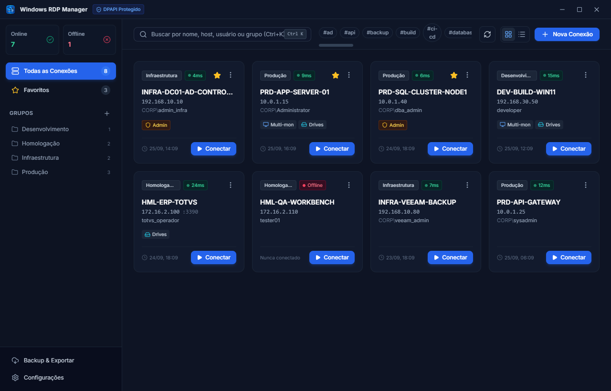
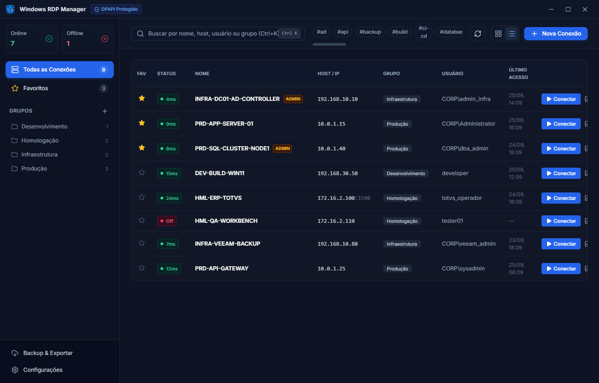
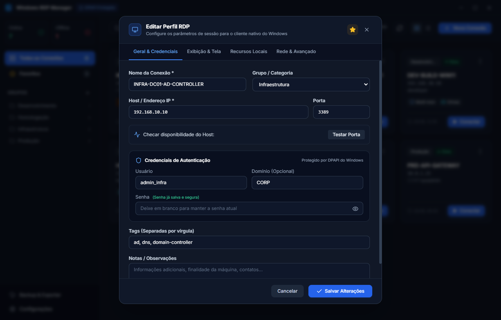
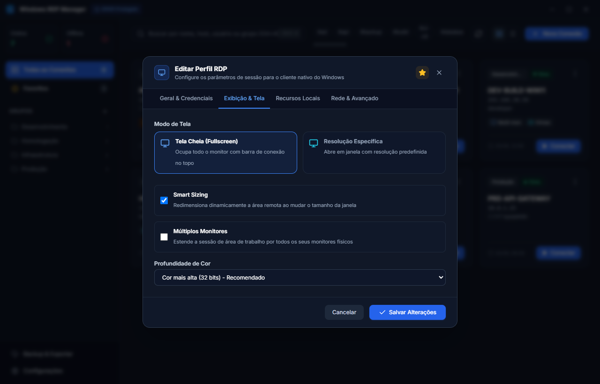
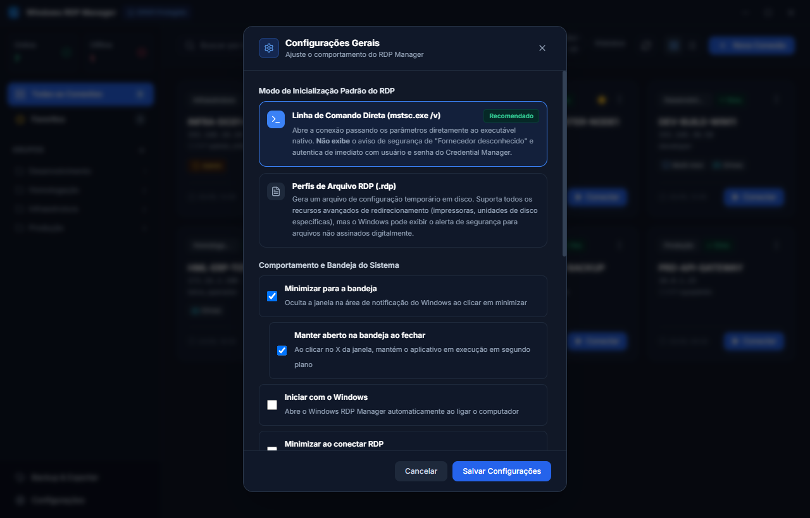

# 🖥️ Windows RDP Manager

Aplicação desktop profissional, moderna e de alta segurança para gerenciar conexões e perfis de Área de Trabalho Remota (**RDP**) no Windows, com integração nativa ao **`mstsc.exe`**.



---

## 📸 Capturas de Tela

### Visão Principal em Grade (Cards)
Interface moderna com cartões informativos, indicação de latência e status online via TCP Ping, tags customizadas e organização por grupos.


### Visão Densa em Lista (Tabela)
Ideal para administração de grande volume de servidores corporativos com visualização tabular rápida e ações com 1 clique.


### Configuração de Perfil RDP e Segurança DPAPI
Armazenamento seguro de credenciais em repouso no Windows Data Protection API (DPAPI) com opções de domínio, porta e teste imediato de conectividade.


### Resoluções, Multi-Monitor e Smart Sizing
Controle granular de dimensões de tela, tela cheia com barra de conexão, múltiplos monitores (`/multimon`) e profundidade de cor.


### Configurações Gerais e Modos de Conexão
Definição de modo nativo (`mstsc /v` direto ou arquivo `.rdp`), comportamento na bandeja do sistema (*system tray*) e senha mestra.


---

## 🔒 Segurança e Armazenamento de Senhas

1. **Windows DPAPI (Data Protection API)**:
   - Todas as senhas salvas são criptografadas em repouso utilizando a API de Proteção de Dados nativa do Windows (`safeStorage`).
   - A chave de criptografia é vinculada à sua conta de usuário do Windows e ao hardware da máquina (TPM). Mesmo que o arquivo de dados seja copiado para outro computador ou lido por outro usuário, ele **não pode ser descriptografado**.
2. **Conexão Direta sem Prompt de Senha**:
   - Ao clicar em "Conectar", o aplicativo registra com segurança a credencial no **Windows Credential Manager** para o destino RDP (`cmdkey /generic:TERMSRV/<host>`).
   - O cliente nativo `mstsc.exe` é aberto com o arquivo de perfil `.rdp` gerado dinamicamente e autentica instantaneamente sem necessidade de digitar a senha manualmente.
3. **Backup e Exportação com Senha Mestra (AES-256-GCM + PBKDF2)**:
   - Para migrar perfis para outro computador ou guardar backup em local seguro, a exportação utiliza criptografia autenticada AES-256-GCM com chave derivada por PBKDF2 (100.000 iterações SHA-256).

---

## 🚀 Funcionalidades

- ⚡ **Abertura Nativa RDP**: Abre diretamente o cliente oficial do Windows (`mstsc.exe`), garantindo suporte total a aceleração de vídeo, redirecionamento de som, microfone, discos e impressoras.
- 🎯 **Verificador de Porta TCP (Ping 3389)**: Teste em tempo real para verificar se o servidor está online e aceitando conexões antes de tentar conectar.
- 🖥️ **Configurações Avançadas de Tela**:
  - Tela Cheia (Fullscreen)
  - Resoluções personalizadas (Full HD, 2K, 4K)
  - Smart Sizing (redimensionamento dinâmico ao ajustar a janela)
  - Suporte a múltiplos monitores (`/multimon`)
- 📁 **Organização por Grupos e Tags**: Categorize servidores por ambiente (*Produção*, *Homologação*, *Infra*, *Clientes*) e adicione tags personalizadas.
- ⭐ **Favoritos e Acesso Rápido**: Fixe seus servidores mais utilizados no topo.
- 🔍 **Busca Instantânea**: Atalho global `Ctrl + K` para localizar qualquer host ou servidor em milissegundos.
- 🗂️ **Dois Modos de Visualização**:
  - Grade de Cards com visual moderno
  - Tabela densa para gerenciamento de grande volume de servidores
- 🛡️ **Sessão Administrativa / Console**: Opção para conectar à sessão zero/console físico do Windows Server (`/admin`).
- 🌐 **Suporte a RD Gateway**: Conecte a servidores corporativos protegidos por Gateway de Área de Trabalho Remota.

---

## 🛠️ Como Executar

### 1. Requisitos
- Windows 10 ou Windows 11
- Node.js 18+ (testado no Node v22)

### 2. Rodar em Modo de Desenvolvimento
```powershell
# Inicia o Vite e o Electron com Live Reload
npm run dev
```

### 3. Rodar a Aplicação Compilada
```powershell
# Constrói o frontend e o backend
npm run build

# Inicia o aplicativo
npm start
```

### 4. Gerar Executáveis e Pacotes de Distribuição

O projeto oferece scripts para gerar o executável autônomo inteligente (Smart Auto-Installer / Instant Launcher) e pacotes `.zip`:

```powershell
# Gera tanto o executável (.exe) quanto o pacote compactado (.zip)
npm run dist

# Gera apenas o executável único (.exe)
npm run dist:exe

# Gera apenas o pacote compactado (.zip) com a aplicação descompactada
npm run dist:zip
```

#### 🚀 Como funciona o Executável Único (`.exe`):
- **1ª Execução:** Instalação silenciosa e rápida (~1.5s) em `%LOCALAPPDATA%\Programs\windows-rdp-manager` com exibição de tela de splash, sem solicitar permissões de administrador (UAC). Cria automaticamente atalhos no Menu Iniciar e na Área de Trabalho e abre a aplicação.
- **2ª Execução em diante:** Ao clicar no `.exe` (ou nos atalhos), ele detecta que a versão já está instalada e abre o aplicativo **instantaneamente em < 0.2s**, sem re-extrair arquivos ou gerar arquivos temporários no `%TEMP%`.
- **Atualização Automática:** Se o usuário baixar e executar uma versão mais nova do `.exe` (ex: v1.0.1 sobre a v1.0.0), ele atualiza os componentes silenciosamente e sobe a nova versão.
- **Splash Screen Integrada:** Conta com tela de carregamento moderna e dark mode na inicialização do aplicativo, proporcionando feedback visual imediato desde o primeiro instante.

Os artefatos gerados ficam disponíveis no diretório `release/`:
- `release/Windows-RDP-Manager-v<versao>-win-x64.exe`: Executável único inteligente com splash screen e abertura instantânea.
- `release/Windows-RDP-Manager-v<versao>-win-x64.zip`: Pacote compactado com a pasta descompactada da aplicação (`win-unpacked`).

### 5. Releases Automáticos com GitHub Actions

O repositório possui uma GitHub Action configurada em `.github/workflows/release.yml`. Para gerar um novo release oficial com os binários anexados automaticamente:

1. Atualize a versão no `package.json` (ex: `1.0.0`)
2. Crie e envie a tag com o prefixo `v`:
   ```powershell
   git tag v1.0.0
   git push origin v1.0.0
   ```
3. O workflow do GitHub Actions será executado automaticamente na máquina Windows (`windows-latest`), compilando o projeto e anexando tanto o `.exe` standalone quanto o `.zip` diretamente à página de **Releases** do repositório! Também é possível disparar manualmente via aba **Actions** no GitHub.

---

## ⌨️ Atalhos de Teclado

- `Ctrl + K`: Focar campo de busca
- `Ctrl + N`: Abrir formulário de nova conexão
- `F5`: Atualizar status de conectividade (ping em lote)
- `Duplo Clique`: Conectar imediatamente ao servidor
